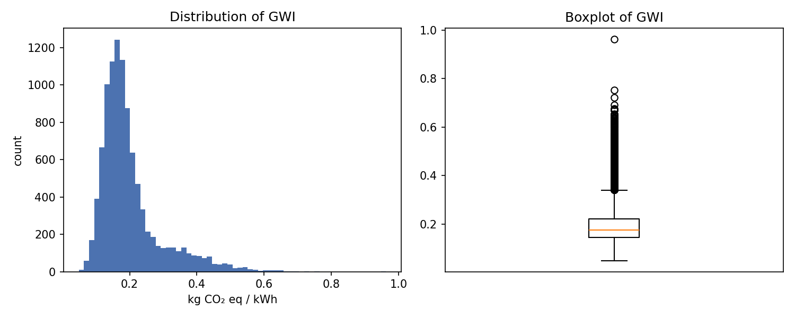
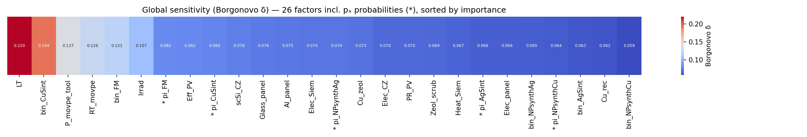

# Ex-ante Probabilistic LCA — one Python pipeline (Monte Carlo + GSA on Brightway2)

A single, reproducible **Python** pipeline for **ex-ante probabilistic life cycle
assessment**: parameter presampling, Monte Carlo uncertainty propagation on a parameterised
[Brightway2](https://brightway.dev/) model, and global sensitivity analysis (GSA) — all in
one place.

It consolidates a workflow that originally spanned **three tools and three languages**:

> **R** (presampling) → **Activity Browser** (LCA calculation) → **MATLAB** (GSA)

into a **single Jupyter notebook**, removing the manual file hand-offs between the steps and
making the whole analysis seedable, version-controlled, and reproducible end-to-end.

Built for emerging-technology assessment, where parameters are uncertain *a priori* and you
want to (a) propagate that uncertainty to the impact result and (b) identify which
parameters drive it. It implements the Monte Carlo + GSA steps of the
Safe-and-Sustainable-by-Design framework of **Blanco et al. (2024)** (see
[Acknowledgments](#acknowledgments)), applied to a III-V/Si tandem PV case study, and is
written so it can be adapted to **any** parameterised Brightway2 project — see
[`docs/WORKFLOW.md`](docs/WORKFLOW.md).

---

## From three tools to one

| Step | Originally | Here (one Python pipeline) |
|---|---|---|
| **Presampling** of uncertain parameters | R | Python — `scipy.stats` (PERT, triangular, normal, lognormal, uniform, Bernoulli, beta) |
| **LCA calculation** per scenario | Activity Browser (manual scenario runs + Excel export) | Python — Brightway2 (`bw2calc`) driven in a loop |
| **GSA** (Borgonovo δ) | MATLAB | Python — [SALib](https://salib.readthedocs.io/) |

```
Presampling  ─►  Monte Carlo simulation  ─►  Global Sensitivity Analysis
(sample X)       (evaluate formulas,            (Borgonovo δ via SALib)
                  run LCA per scenario → Y)
```

Why consolidate: one language and environment instead of three; no CSV/Excel hand-offs
between tools; a single fixed random seed makes the entire chain reproducible; and the whole
analysis lives in version control.

### What surfaced while porting the calculation into Python

Reproducing the Activity Browser numbers in Python initially gave different answers. Running
every variant against a clean restore of the project pinned down why — and these findings
are baked into the notebook as guards:

| Problem | Symptom | Handling |
|---|---|---|
| **NumPy 2.0 kernel** | `np.NaN was removed in the NumPy 2.0 release` crash in `lci()` | Use a **numpy < 2** kernel (`bw2data 3.6.x` is incompatible with numpy ≥ 2); Layer 1 warns you |
| **Only one database scanned** | The 4 Si‑supply‑chain activity parameters had no effect; their GSA sensitivity was a spurious zero | Evaluate formula exchanges in **all** relevant databases; a validation gate flags unused parameters |
| **Database contamination** | Re‑running gave drifting results | Overwrite **every** parameterised exchange every iteration → the result becomes state‑independent |
| **AB scenario export not reproducible** | AB produced **different numbers on identical inputs** between runs, matching no consistent parameter application | A further reason to script the calculation: this Python pipeline is deterministic given the sample matrix |

On a clean database the Python pipeline reproduces the original parameter approach
**exactly** (`0.136787, 0.188661, 0.105696, …`) and gives the same answer on every run.

---

## Example results — III‑V/Si tandem PV (10,000 iterations)

Global warming impact of 1 kWh of electricity (ILCD 2.0 climate change total), propagating
**all 26 uncertain factors** — including the five `pₓ` success‑probabilities, which enter the
analysis indirectly via the binary design choices they parameterise (the thesis's full t=0 model).

**Output distribution** (kg CO₂‑eq / kWh): mean **0.200**, median **0.175**, P5 **0.106**,
P95 **0.405** — right‑skewed, with a long tail toward higher impacts.



**Global sensitivity (Borgonovo δ)** — which factors drive that spread (`*` = indirect `pₓ`):



| Rank | Factor | δ | S1 | Meaning |
|---|---|---|---|---|
| 1 | `LT` | 0.220 | 0.174 | Panel lifetime (sets the per‑kWh denominator) |
| 2 | `bin_CuSint` | 0.194 | 0.380 | Cu laser‑vs‑chemical sintering choice (largest first‑order variance share) |
| 3 | `P_movpe_tool` | 0.137 | 0.069 | MOVPE tool power load |
| 4 | `RT_movpe` | 0.126 | 0.045 | MOVPE runtime |
| 5 | `bin_FM` | 0.121 | 0.053 | Front‑metal nanoink choice |
| 6 | `Irrad` | 0.107 | 0.030 | Irradiation |
| 7 | `* pi_FM` | 0.082 | 0.010 | P(Cu vs Ag nanoink) |
| 9 | `* pi_CuSint` | 0.080 | 0.006 | P(laser sintering Cu) |

Lifetime and the discrete copper‑sintering choice dominate; the rest contribute modestly. Full
table: [`examples/gsa_delta_results.csv`](examples/gsa_delta_results.csv). Regenerate everything
by running the notebook end to end.

### How this compares to the thesis (Blanco 2022, Ch. 6)

**Consistent, not identical.** The impact magnitude (~0.20 kg CO₂‑eq/kWh) matches the thesis's
t=0 snapshot, and the same *set* of factors dominates (lifetime, MOVPE power & runtime, the
front‑metal choice). The **ordering differs** — the thesis t=0 ranks `P_movpe_tool` first and finds
the `pₓ` more influential than the binaries, whereas we get `LT` first and the binaries above their
`pₓ`. This is structural, not a parameter‑selection issue:

- **Functional unit.** Per‑kWh impact ∝ `1/(LT·Irrad·Eff·PR)`, so lifetime/irradiation scale the
  *whole* footprint while `P_movpe_tool` scales only the MOVPE branch — elevating `LT` here.
- **Discrete‑jump size.** `bin_CuSint` injects a large discrete impact (laser‑sintering reagents),
  making the binary dominate and diluting its `pₓ`. The thesis itself notes this binary‑vs‑`pₓ`
  ordering flips between its case studies, i.e. it is model‑specific.
- **Different model.** This runs the reconstructed `SiTaSol_F2v1a`/`IEA_PVPS_2020` databases with
  ILCD 2.0, not the thesis's exact integrated LCA — so exact δ values aren't expected to coincide.

---

## Quick start

```bash
# 1. Create an environment with numpy < 2 (critical!)
conda env create -f environment.yml
conda activate bw2-mc-gsa

# 2. Launch Jupyter and open the notebook
jupyter lab MC_workflow.ipynb
```

### Two notebooks

| Notebook | Use it when |
|---|---|
| **`MC_workflow.ipynb`** (recommended) | Structured/layered. All case-specific settings live in two layers at the top (environment binding + a declarative **parameter registry**); a validation gate auto-checks parameters against the model formulas. Best for adapting to new cases. |
| `MC_workflow_simple.ipynb` | Minimal, everything inline. Good for a quick read of the bare mechanism. |

Run the structured notebook top to bottom — the layers:

| Layer | Purpose | Edit? |
|---|---|---|
| 1 | Imports, **numpy‑version check**, project/databases/FU/method | per project |
| 2 | **Parameter registry** — one declarative table of parameters + distributions | **most often** |
| 3 | Presampling → `PROB_X_t0.csv` (generic; skip if you have it) | rarely |
| 4 | Load the sample matrix `X` | never |
| 5 | Index formula exchanges in **all** DBs + **validation gate** + introspection table | never |
| 6 | Engine + **verification** (5 scenarios vs the reproducible reference) | set ref once |
| 7 | Full Monte Carlo run (10 000 iterations) → `Model_results_python.csv` | never |
| 8 | Histogram + boxplot of the output distribution | per question |
| 9 | GSA (Borgonovo δ) → `GSA_results.csv` + `GSA_heatmap.png` | per question |

> **Always run the verification (Layer 6) first.** If the 5 scores match the reference, the
> full run will too. If they don't, check the kernel/numpy version and that every
> parameterised database is listed in `PARAMETERISED_DBS`.

The **validation gate** in Layer 5 cross-checks your parameter registry against the actual
model formulas and **fails loudly** if a parameter is unresolved or silently unused — this
is what prevents the "I forgot a database, so 4 parameters did nothing" class of bug.

---

## The one principle that makes it reproducible

> **Every parameterised exchange is overwritten from the parameters in every iteration.**

Because nothing is left at a "default", the LCA score depends only on the sampled
parameter vector — **not** on whatever state the database was left in by a previous run.
This is why the workflow is immune to the database contamination that made earlier
attempts (and the AB scenario engine) non‑reproducible.

---

## Repository layout

```
.
├── MC_workflow.ipynb         # structured/layered workflow (recommended)
├── MC_workflow_simple.ipynb  # minimal all-inline variant
├── environment.yml           # conda env (numpy < 2, brightway2, SALib, …)
├── requirements.txt          # pip alternative
├── examples/
│   └── PROB_X_t0_short.csv    # 10-scenario sample matrix for a fast verification run
├── docs/
│   └── WORKFLOW.md           # how to adapt this to your own Brightway2 project
└── LICENSE
```

The Brightway2 project backup, ecoinvent databases and course materials are **not**
included (licensing + size). Point the notebook at your own project.

---

## Requirements

- Python ≥ 3.9
- **numpy < 2** (hard requirement for `bw2data` 3.6.x)
- `brightway2`, `bw2data`, `bw2calc`, `bw2io`
- `SALib`, `scipy`, `pandas`, `matplotlib`, `seaborn`

See [`environment.yml`](environment.yml).

---

## Acknowledgments

The III‑V/Si tandem photovoltaics case study, the parameterised model, and the underlying
**Safe‑and‑Sustainable‑by‑Design (SSbD) global‑sensitivity framework** are the work of
**Carlos Felipe Blanco** and colleagues at the Institute of Environmental Sciences (CML),
Leiden University. Carlos developed the original analysis across **R** (presampling),
the **Activity Browser** (LCA calculation), and **MATLAB** (GSA).

This repository ports that same method into a **single Python pipeline** on Brightway2 —
the contribution here is the consolidation and reproducibility, not the method itself. Full
credit for the framework, the model, and the case study goes to Carlos and co‑authors.

## References

- Blanco, C. F., Behrens, P., Vijver, M. G., Peijnenburg, W. J. G. M., Quik, J. T. K., &
  Cucurachi, S. (2024). **A framework for guiding safe and sustainable‑by‑design innovation.**
  *Journal of Industrial Ecology, 29*(1).
  https://doi.org/10.1111/jiec.13609
- Blanco Rocha, C. F. (2022). *Guiding safe and sustainable technological innovation under
  uncertainty: a case study of III‑V/silicon photovoltaics* (PhD thesis, Leiden University).
  https://hdl.handle.net/1887/3455392

If you use this workflow in academic work, please cite the framework paper above.

## License

[MIT](LICENSE)
