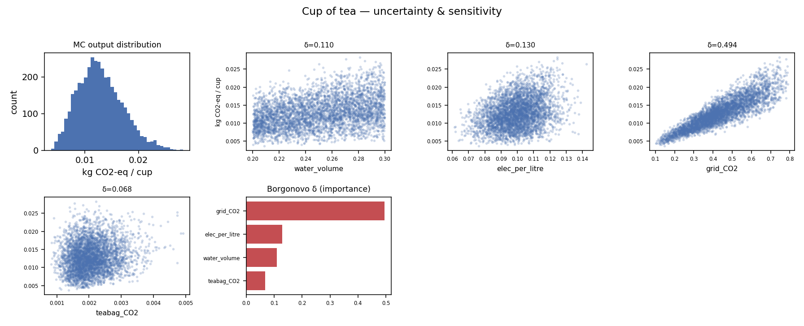
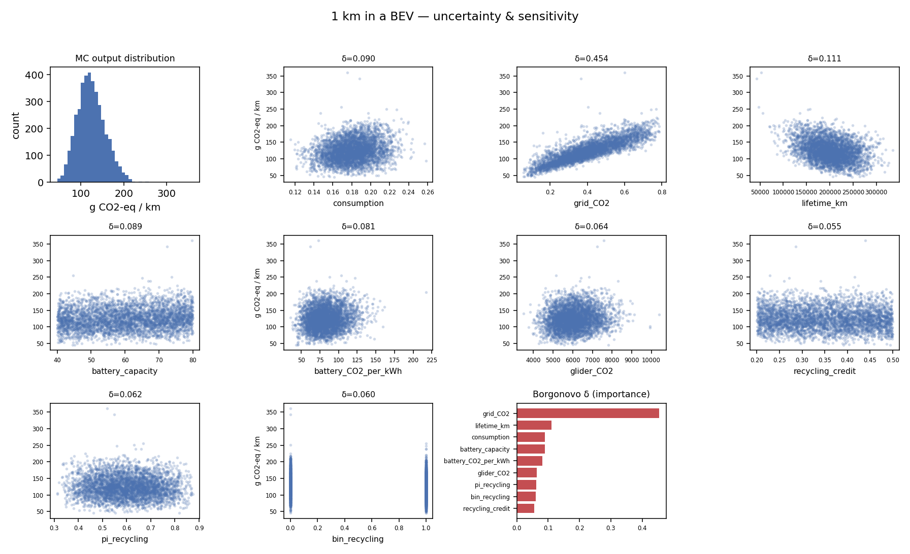

# Educational examples

Two small, **self‑contained** notebooks that teach the same workflow as the main
`MC_workflow.ipynb` (presample → Monte Carlo → Borgonovo δ GSA) on toy models you can
sanity‑check by hand. They build their own tiny Brightway2 project — **no ecoinvent, no
project backup needed**.

> Run with a **numpy < 2** kernel (`bw2data 3.6.x` requirement).

Each notebook produces the same set of visuals as the real analysis: the Monte Carlo
output distribution, a **scatter of the output against every input** (the shape shows how
each factor acts), and the **Borgonovo δ ranking**.

---

## 1. `tea_demo.ipynb` — carbon footprint of a cup of tea

`GWI = (water_volume · elec_per_litre) · grid_CO₂ + teabag_CO₂`

Four parameters, four distributions. Result ≈ **0.013 kg CO₂‑eq/cup**.

**δ ranking:** `grid_CO2` (0.49) ≫ `elec_per_litre` (0.13) ≈ `water_volume` (0.11) ≫ `teabag_CO2` (0.07).
The `grid_CO2` scatter shows a strong trend; `teabag_CO2` is a flat cloud → negligible.
**Lesson:** decarbonising the electricity matters far more than the tea bag.

---

## 2. `ev_demo.ipynb` — 1 km in a battery‑electric vehicle

`GWI/km = consumption·grid_CO₂ + (glider_CO₂ + capacity·battery_CO₂·(1 − recycle·credit)) / lifetime_km`

A step up: manufacturing vs use‑phase competition, a value in the **denominator**
(`lifetime_km`), and a **discrete design choice drawn from an uncertain probability**
(`pi_recycling → bin_recycling` — the `bin_*`/`pi_*` pattern from the real study).
Result ≈ **125 g CO₂‑eq/km**.

**δ ranking:** `grid_CO2` (0.45) ≫ `lifetime_km` (0.11) > `consumption` ≈ `battery_capacity` ≈ `battery_CO2_per_kWh` > recycling group.

Three lessons, each mirroring the III‑V/Si PV case:
1. **Grid intensity dominates** → decarbonising electricity beats most design tweaks.
2. **A lifetime in the denominator is highly influential** — exactly why `LT` topped the PV GSA.
3. The recycling **binary outranks its own probability** `pi_recycling` (the discrete jump it
   causes is large) — the same `bin > pₓ` behaviour seen in the real study. The `bin_recycling`
   scatter shows the tell‑tale two vertical stripes (the 0/1 choice).

> Classroom exercise: narrow `grid_CO2`'s range (simulate a known clean grid) and re‑run —
> `lifetime_km` takes over the top spot. That is *why* the real PV ranking is sensitive to the
> functional unit and the parameter ranges.
